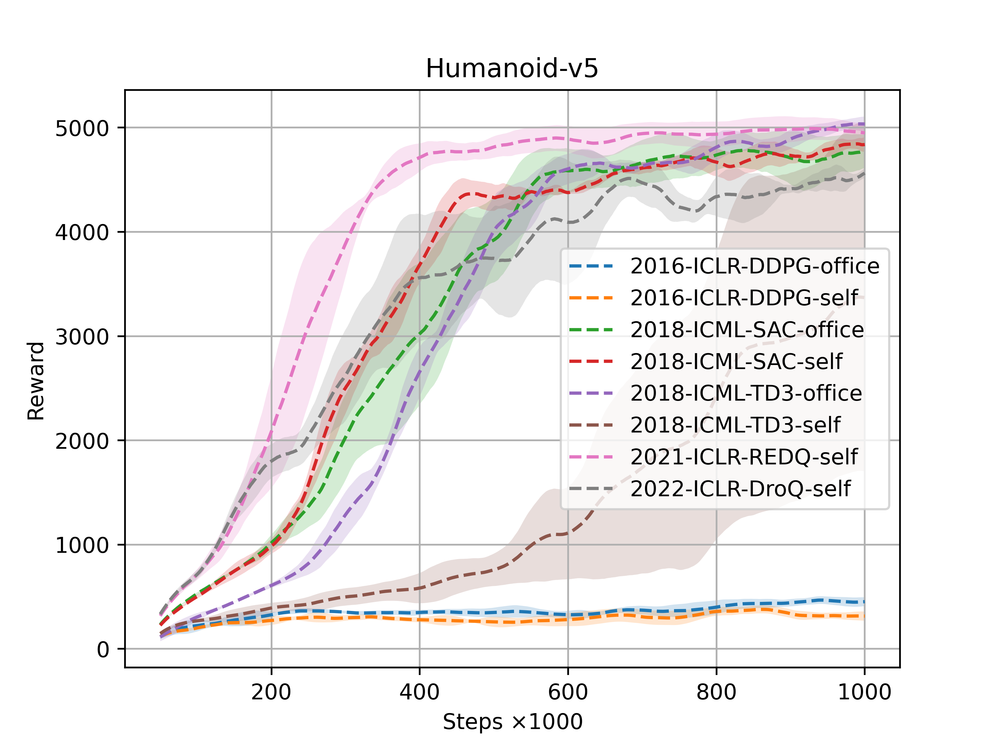
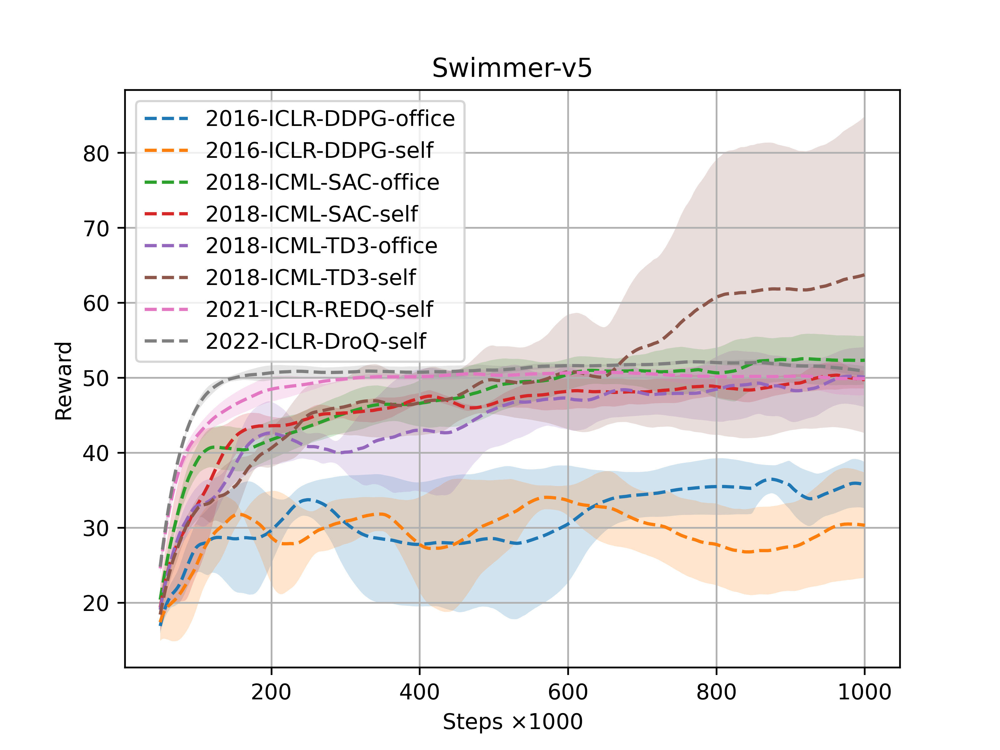
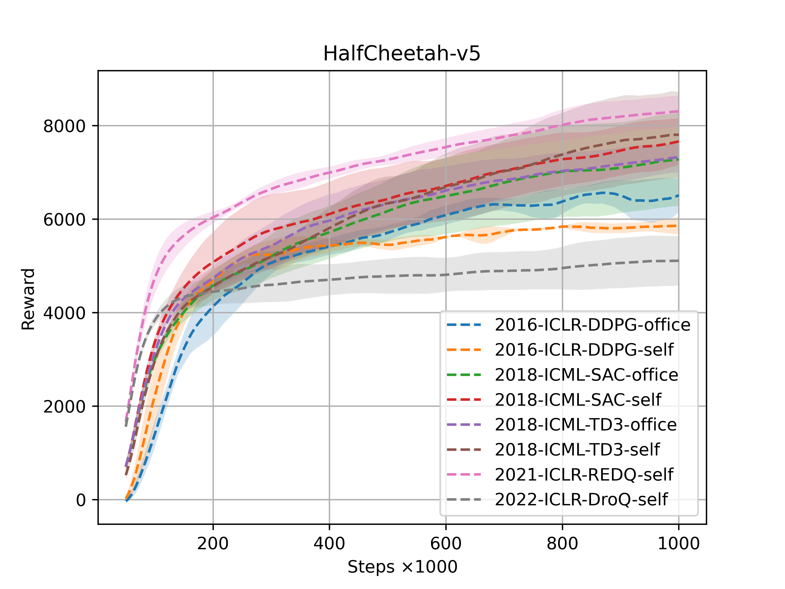
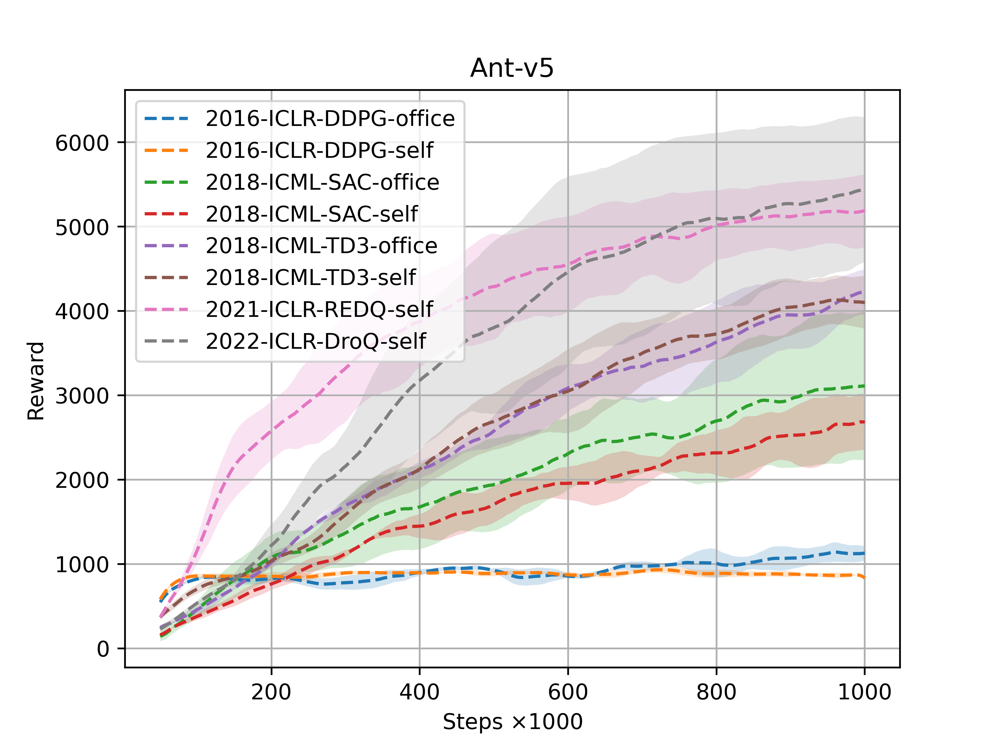

# Analysis of Performance in OfflineRL

[toc]

## Introduction

### Preface

​	Offline RL (Reinforcement Learning) 以提高样本效率而闻名，并且得到了广泛关注（实验室和工业界）。现有的offline RL算法层出不穷，但是并不知道哪种offline RL算法在某些特定任务中更加出色，以及大多数任务上哪种offline RL算法更甚一筹。

​	为了给予一些offlineRL性能一些客观评价，本人做了一个算法的性能评估。为此，我们需要进行如下的说明：

1. 随着具身智能的火热，我们评估环境主要在机器人的运动和操作任务上进行，如MuJoCo（Hopper、Walker2d、Humanoid、Swimmer、HalfCheetah和Ant）、MetaWorld。
2. 我们评估的offline RL算法有如下，主要包括经典的和最近的前沿offline RL：
   - [2016-ICLR-DDPG](https://arxiv.org/pdf/1509.02971)
   - 2018-ICML-SAC
   - 2018-ICML-TD3
   - 2021-ICLR-REDQ
   - 2022-ICLR-DroQ
   - 2022-ICML-AQE
   - 2025-Preprint-FPO
   - 2025-Preprint-FQL
3. 特别说明：以下实验结果仅供参考学习，未经允许不得用于其它任何用途。

> [!CAUTION]
>
> 1. 如果有“office”标识，则表示官方源代码实现；若有“self”标识，则表示本人的手写复现。
> 2. 该项目的实验代码并未公开，感兴趣的可以联系本人或查看官方代码。

### Preview

#### Performance MuJoCo for Offline RL

    <figure style="flex: 1;">
        
        <figcaption>MuJoCo:Hopper</figcaption>
    </figure>
    <figure style="flex: 1;">
		
		<figcaption>MuJoCo: Walker2d</figcaption>
	</figure>
    <figure style="flex: 1;">
		
		<figcaption>MuJoCo: Humanoid</figcaption>
	</figure>

    <figure style="flex: 1;">
		
		<figcaption>MuJoCo: Swimmer</figcaption>
	</figure>
    <figure style="flex: 1;">
        
		<figcaption>MuJoCo: HalfCheetah</figcaption>
	</figure>
    <figure style="flex: 1;">
        
		<figcaption>MuJoCo: Ant</figcaption>
	</figure>

#### Video MuJoCo for Offline RL

    <figure style="flex: 1;">
        <video src="./pics/OfflineRL性能分析/P1_online_1000_Hopper-v5-TD3-self.mp4" width="90%" controls autoplay loop></video>
        <figcaption>Initial MuJoCo-Hopper</figcaption>
    </figure>
    <figure style="flex: 1;">
		<video src="./pics/OfflineRL性能分析/P1_online_1000000_Hopper-v5-TD3-self.mp4" width="90%" controls autoplay loop></video>
		<figcaption>Final MuJoCo-Hopper</figcaption>
	</figure>

## Analysis of Performance

### Analysis of Performance for MuJoCo-Hopper

#### Training Curve MuJoCo-Hopper

#### Video of Initial and End Performance  for MuJoCo-Hopper

- 以下是2016-ICLR-DDPG-office在MuJoCo-Hopper上的表现效果（左边视频是初始时期的策略表现，右边视频是经过100万样本数据训练后表现）：

    <figure style="flex: 1;">
        <video src="./pics/OfflineRL性能分析/P1_online_1000_Hopper-v5-DDPG-office.mp4" width="90%" controls autoplay loop></video>
        <figcaption>2016-ICLR-DDPG Initial MuJoCo-Hopper</figcaption>
    </figure>
    <figure style="flex: 1;">
		<video src="./pics/OfflineRL性能分析/P1_online_1000000_Hopper-v5-DDPG-office.mp4" width="90%" controls autoplay loop></video>
		<figcaption>2016-ICLR-DDPG Final MuJoCo-Hopper</figcaption>
	</figure>

### Analysis of Performance for MuJoCo-Walker2d

#### Training Curve MuJoCo-Walker2d

#### Video of Initial and End Performance  for MuJoCo-Walker2d

### Analysis of Performance for MuJoCo-Humanoid

#### Training Curve MuJoCo-Humanoid

#### Video of Initial and End Performance  for MuJoCo-Humanoid

### Analysis of Performance for MuJoCo-Swimmer

#### Training Curve MuJoCo-Swimmer

#### Video of Initial and End Performance  for MuJoCo-Swimmer

### Analysis of Performance for MuJoCo-HalfCheetah

#### Training Curve MuJoCo-HalfCheetah

#### Video for MuJoCo-HalfCheetah

### Analysis of Performance for MuJoCo-Ant

#### Video of Initial and End Performance  for MuJoCo-Ant

- 以下是2016-ICLR-DDPG-office在MuJoCo-Ant上的表现效果（左边视频是初始时期的策略表现，右边视频是经过100万样本数据训练后表现）：

     
    <video src="./pics/OfflineRL性能分析/P1_online_1000_Ant-v5-DDPG-office.mp4" autoplay loop width="30%" controls="controls" ></video>
	<video src="./pics/OfflineRL性能分析/P1_online_1000000_Ant-v5-DDPG-office.mp4" autoplay loop width="30%" controls="controls"></video>

- 以下是2016-ICLR-DDPG-self在MuJoCo-Ant上的表现效果（左边视频是初始时期的策略表现，右边视频是经过100万样本数据训练后表现）：

    <video src="./pics/OfflineRL性能分析/P1_online_1000_Ant-v5-DDPG-self.mp4"  autoplay loop width="30%" controls="controls"></video>
    <video src="./pics/OfflineRL性能分析/P1_online_1000000_Ant-v5-DDPG-self.mp4"  autoplay loop width="30%" controls="controls"></video>

- 以下是2018-ICML-SAC-office在MuJoCo-Ant上的表现效果（左边视频是初始时期的策略表现，右边视频是经过100万样本数据训练后表现）：

    <video src="./pics/OfflineRL性能分析/P1_online_1000_Ant-v5-SAC-office.mp4"  autoplay loop width="30%" controls="controls"></video>
    <video src="./pics/OfflineRL性能分析/P1_online_1000000_Ant-v5-SAC-office.mp4"  autoplay loop width="30%" controls="controls"></video>

- 以下是2018-ICML-SAC-self在MuJoCo-Ant上的表现效果（左边视频是初始时期的策略表现，右边视频是经过100万样本数据训练后表现）：

    <video src="./pics/OfflineRL性能分析/P1_online_1000_Ant-v5-SAC-self.mp4"  autoplay loop width="30%" controls="controls"></video>
    <video src="./pics/OfflineRL性能分析/P1_online_1000000_Ant-v5-SAC-self.mp4"  autoplay loop width="30%" controls="controls"></video>

- 以下是2018-ICML-TD3-office在MuJoCo-Ant上的表现效果（左边视频是初始时期的策略表现，右边视频是经过100万样本数据训练后表现）：

    <video src="./pics/OfflineRL性能分析/P1_online_1000_Ant-v5-TD3-office.mp4"  autoplay loop width="30%" controls="controls"></video>
    <video src="./pics/OfflineRL性能分析/P1_online_1000000_Ant-v5-TD3-office.mp4"  autoplay loop width="30%" controls="controls"></video>

- 以下是2018-ICML-TD3-self在MuJoCo-Ant上的表现效果（左边视频是初始时期的策略表现，右边视频是经过100万样本数据训练后表现）：

